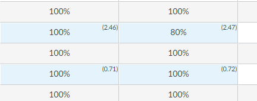

# Days Late in Canvas Gradebook

This is a very short Tamper Monkey script that will add the number of days late inside the Canvas gradebook so that you don't have to click on each assignment to look. 




## Installation

1. Install the Tamper Monkey extension for your browser. See [TamperMonkey.net](https://www.tampermonkey.net/) for more information.

2. Click on the Tamper Monkey icon in your browser and select "Create a new script..."

3. Copy and paste the following code into the new script.

```javascript
// ==UserScript==
// @name         Days Late in Canvas Gradebook
// @namespace    https://compsci.rocks
// @version      2024-10-07
// @description  Adds the number of days late to the Canvas gradebook.
// @author       Ryan Nutt
// @website      https://compsci.rocks
// @match        https://*.instructure.com/courses/*/gradebook
// @grant        none
// @icon         https://www.google.com/s2/favicons?sz=64&domain=compsci.rocks
// ==/UserScript==

(function() {
    'use strict';

    const script = document.createElement('script');
    script.src = 'https://scripts.compsci.rocks/canvas/days-late/latest/index.js';
    document.head.appendChild(script);
})();
```
4. Save the script

The script will always pull the latest version of the code from our CDN so you don't need to worry about updating it in Tamper Monkey. 
